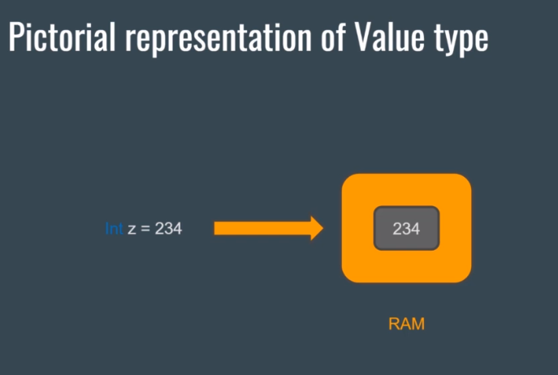

# Section 2: DataTypes And Variables

# High Level Overview of Variables and Datatypes

What is a variable?

-   A container that can take a value

# More Datatypes and Their Limits

### Variable Example with default value

```cs
public class Lecture
{
    int age = 15; // This is a variable of type integer

    public static void Main(string[] args)
    {
        Console.WriteLine(age); // The output will be 15
    }
}
```

### Variable Example with new assigned value

```cs
public class Lecture
{
    int age = 15; // This is a variable of type integer

    public static void Main(string[] args)
    {
        age = 20; //New value assigned
        Console.WriteLine(age); // The output will be 20
    }
}
```

### Variable Example with no value

```cs
public class Lecture
{
    int age; // Default is assigned 0

    public static void Main(string[] args)
    {
        Console.WriteLine(age); // The output will be 0
    }
}
```

### Variable Declared within a Method

```cs
public class Lecture
{

    public static void Main(string[] args)
    {
        // Creating a variable inside of the method
        // The variable can only get used inside of this method
        int age = 15;
        Console.WriteLine(age); // The output will be 15
    }
}
```

## Primitive data types

### Integral

-   sbyte x = 1;
    -   range from -128 - 127
-   short x = 1;
    -   range from -32,768 - 32,767
-   integer x = 1;
    -   range from -2,147,483,648 - 2,147,483,647
-   long x = 1;
    -   range from –9,223,372,036,854,775,808 to 9,223,372,036,854,775,807

Choose the smallest type your value fits into.

### Floating point

-   float x = 0.5f;
    -   range from 1.5 × 10^−45 - 3.4 × 10^38
    -   7-digit precision
-   double x = 0.5;
    -   range from 5.0 × 10^−324 - 1.7 × 10^308 -
    -   15-digit precision
-   decimal x = 0.5m;
    -   range from –7.9 × 10^−28 - 7.9 × 10^28
    -   28-digit precision

Use **float** for 3D graphics, **double** for everything (except money calculations) and **decimal** for financial applications.

### Boolean

-   bool switch = true;

Use a boolean if you want to set something to true or false (just like a toggle).

### Unicode characters and strings

-   char singleLetter = 'A';
    -   will only allow a single character literal or unicode
-   string name = "John Doe";
    -   allows multiple letters and unicodes

Use a string for a path, username, birthdate...

[Different Types Link](https://docs.microsoft.com/en-us/dotnet/csharp/tour-of-csharp/types)

# Coding Standards

-   [Microsoft Docs on C# Coding Conventions](https://docs.microsoft.com/en-us/dotnet/csharp/fundamentals/coding-style/coding-conventions)

### What are Coding Standards

-   A set of guidelines, best practices and programming styles that developers followed when writing source code for a project.

### What Makes Good Coding Standards

-   Reasonable Variable Names
-   Proper Method Name
-   Comments

### Commenting styles

-   Single-Line Comments

```cs
// a bool to check if the user is logged in
bool isUserLoggedIn = true;
```

-   MultiLine Comments

```cs
/*These methods are responsible for storing user data and connecting to the database. */
```

-   XML Documentation Comments

```cs
///<summary>
//This method is very cool
///</summary>
void CoolMethod()
{
    //cool code
}
```

# Value Type vs Reference Type

## [Value Type](https://www.tutorialsteacher.com/csharp/csharp-value-type-and-reference-type)

-   A data type is a value type if it holds a data value within its own memory space. It means the variables of these data types directly contain values.

-   In other words, A value type is a data type which when declared and assigned a value, holds the **value directly ion its own memory** space.

-   The value type uses a heap to store the value.



### The following data types are all of value type:

-   bool
-   byte
-   char
-   decimal
-   double
-   enum
-   float
-   int
-   long
-   sbyte
-   short
-   struct
-   uint
-   ulong
-   ushort

## [Reference Type](https://www.tutorialsteacher.com/csharp/csharp-value-type-and-reference-type)

-   Unlike value types, a reference type doesn't store its value directly. Instead, it stores the address where the value is being stored. In other words, a reference type contains a pointer to another memory location that holds the data.

-   In other words, instead of storing the value in memory directly, **stores the memory location** of the actual data.

-   The variable here stores the memory reference of the data and not the data directly.

-   When we copy the reference type of a data type it will just copy the memory address of the data so we will then have two variables pointing to the same data.


### The followings are reference type data types:

-   String
-   Arrays (even if their elements are value types)
-   Class
-   Delegate

# [Console Methods](https://docs.microsoft.com/en-us/dotnet/api/system.console.writeline?view=netcore-3.1#System_Console_WriteLine_System_String_)

## Console Methods Explained

-   Console.Write("Text Here")
    -   Prints and keeps the cursor in the **same line**.
-   Console.WriteLine("Text Here")
    -   Prints and puts the cursor on the **next line**.
-   Console.Read()
    -   Takes a single input of type string and it **returns the ASCII value** of that input.
-   Console.ReadLine()
    -   Takes a string or integer input and **returns it as the Output** value.
-   Console.ReadKey()
    -   Takes a single input of type string and it **returns the Key info**.

### What is [ASCII](https://www.ascii-code.com/)?

    - American Standard Code for Information Interchange

### Example

```cs
Console.WriteLine("HELLO WORLD");
Console.Write("HELLO");
Console.Write("WORLD");
Console.ReadKey();
```

### Output

```console
Hello World
HelloWorld
```

### Example for ReadLine();

```cs
static void Main(string[] args) {
    Console.Write("Enter a string and press enter: ");
    string readInput = Console.ReadLine();
    Console.WriteLine("You have entered {0}", readInput);

    Console.Write("Enter a key and press enter: ");
    string asciiValue = Console.Read();
    Console.WriteLine("ASCII value is {0}", asciiValue);
    Console.ReadKey();
}
```

### Expected Output

```console
Enter a string and press enter: Amir
You have entered Amir
Enter a key and press enter: A
ASCII value is 65
```

# [Naming Conventions and Coding Standards](https://www.dofactory.com/csharp-coding-standards)

```cs
namespace HelloWorld
{
    // Classes should be in PascalCase
    class ClientActivity
    {
        // Method names should also be in PascalCase
        // method arguments should be in camelCase
        static void Main(string[] args)
        {
            // local variables should be in camelCase

            // avoid abbreviations userControl vs usrCtrl

            // don't use numbers at the start of variable names

            // avoid using _
            // exception is an _ at the beginning of a name.

            // don't capitalize string, int, bool, etc.

            // use nouns for Classes
        }
    }
}
```

# Implicit, Explicit and Type Conversion

```cs
namespace HelloWorld
{
    class Program
    {
        static void Main(string[] args)
        {
            // Implicit Conversion
            int num = 12390532;
            long bigNumber = num;

            float myFloat = 13.37f;
            double myNewDouble = myFloat;

            // Explicit Conversion
            double myDouble = 13.37;
            int myInt;
            // Cast double to int
            myInt = (int)myDouble;
            Console.WriteLine(myInt); // will be 13

            //Type Conversion
            string myString = myDouble.ToString(); //"13.37"
            num.ToString();
            bool sunIsShining = true;
            string myBoolString = sunIsShining.ToString();

        }
    }
}
```

# Parsing a String To An Integer

```cs
namespace HelloWorld
{
    class Program
    {
        static void Main(string[] args)
        {
            string myString = "15";
            string mySecondString = "13";
            int num1 = Int32.Parse(myString);
            int num2 = Int32.Parse(mySecondString);
            int resultInt = num1 + num2;
            string result = resultInt.ToString();
        }
    }
}
```

# String Manipulation

```cs
namespace HelloWorld
{
    class Program
    {
        static void Main(string[] args)
        {
            // define a few variables
            int age = 31;
            string name = "Alfonso";

            // 1. String Concatenation
            Console.WriteLine("String Concatenation");
            Console.WriteLine("Hello my name is " + name + ", I am " + age + " years old");

            // 2. String Formatting
            Console.WriteLine("String Formatting");
            Console.WriteLine("Hello my name is {0}, I am {1} years old", name, age);
        }
    }
}
```

# Some String Methods

Strings are just a sequence of characters

-   **Substring(int32)** - is used to get the Substring from the string, starting from the specific index.
-   **ToLower()** - is used to convert the string to lowercase.

-   **ToUpper()** - is used to convert the string to uppercase.

-   **Trim()** - is used to trim the leading and trailing white space from the string.

-   **IndexOf(string)** - is used to get the first occurrence of the string or character inside the string.

-   **IsNullOrWhiteSpace** - returns true if the string is either null or is blank else it returns false.

```cs
static void Main(String[]args) {
    string firstName = "Amir";
    string lastName = "Harrison";
    string fullName - string.Concat("", firstName, lastName, "");
    console.WriteLine(firstName.Substring(2)); // output: "ir"
    console.WriteLine(firstName.ToLower()); // output: "amir"
    console.WriteLine(firstName.ToUpper()); // output: "AMIR"
    console.WriteLine(fullName.Trim()); // output: "amirharrison"
    console.WriteLine(firstName.IndexOf('m')); // output: 1
    console.WriteLine(string.IsNullOrWhiteSpace(firstName)); // output: false
}
```

### String.Format Explained

-   In C# the String.Format method is used to insert the object or variable value inside any string.
-   With the String.Format we can replace the value in the specified format.
-   Syntax: String.Format("any string {index}", object);

## String Challenge 2

### My Attempt

```cs
namespace StringsChallenge2
{
    class Program
    {
        static void Main(string[] args)
        {
            Console.Write("Enter a string here: ");
            string EnteredString = Console.ReadLine();
            Console.Write("Enter the character to search: ");
            string keyCharacter = Console.ReadLine();
            Console.WriteLine(EnteredString.IndexOf(keyCharacter));

            Console.Write("What is your first name? ");
            string firstName = Console.ReadLine();
            Console.Write("What is your last name? ");
            string lastName = Console.ReadLine();
            Console.WriteLine(String.Format("Your name is {0} {1}", firstName, lastName));

            Console.Read();

        }
    }
}
```

### His Answer

```cs
namespace StringsChallenge2
{
    class Program
    {
        static void Main(string[] args)
        {
            Console.Write("Enter a string here: ");
            string input = Console.ReadLine();

            Console.Write("Enter the character to search: ");
            char searchInput = Console.ReadLine()[0];

            int searchIndex = input.IndexOf(searchInput);
            Console.WriteLine("The index of the character {0} in the string is {1}", searchInput, searchIndex);

            //Console.WriteLine(EnteredString.IndexOf(keyCharacter));

            Console.Write("What is your first name? ");
            string firstName = Console.ReadLine();
            Console.Write("What is your last name? ");
            string lastName = Console.ReadLine();

            string fullName = string.Concat(firstName, " ", lastName);
            Console.WriteLine("Your full name is {0}.", fullName);


            Console.ReadKey();

        }
    }
}
```

## Challenge-Data Types and Variables

### The Problem

Now that you know how to declare and initialize Variables, please go ahead and create a variable for each of the primitive datatypes (you can find the list here). Leave the Object datatype out.
And also please initialize each variable with a working value.
Then create two values of type string.
The first one should say "I control text"

The second one should be a whole number. Then use the Parse method in order to convert that string to an integer.

Add each an output for each of the variables and write it onto the console. (WriteLine)
Feel free to name your variables as you like, but keep in mind, that my result's variable names will differ to yours.
Have fun :)

### My Answer

```cs
namespace Challenge___Datatypes_And_Variables
{
    class Program
    {
        static void Main(string[] args)
        {
            byte smallByte = 42;
            sbyte verySmallByte = -42;
            int num = 500;
            long big = 555555;
            float decima = 2.33f;
            double myNewDouble = .1;
            string text = "I control text";
            string number = "23";
            int toInt = Int32.Parse(number);

            Console.WriteLine(smallByte);
            Console.WriteLine(verySmallByte);
            Console.WriteLine(num);
            Console.WriteLine(big);
            Console.WriteLine(decima);
            Console.WriteLine(myNewDouble);
            Console.WriteLine(text);
            Console.WriteLine(number);
            Console.WriteLine(toInt);
        }
    }
}
```

### His Answer

````cs
namespace HelloWorld
{
    class Program
    {

        static void Main(string[] args)
        {
            byte myByte = 25;
            Console.WriteLine(myByte);
            sbyte mySbyte = -15;
            Console.WriteLine(mySbyte);
            int myInt = -12318925;
            Console.WriteLine(myInt);
            uint myUint = 123091;
            Console.WriteLine(myUint);
            short myShort = -32768;
            Console.WriteLine(myShort);
            ushort myUShort = 65535;
            Console.WriteLine(myUShort);
            float myFloat = -31.1289f;
            Console.WriteLine(myFloat);
            double myDouble = -12.1231250;
            Console.WriteLine(myDouble);
            char myCharacter = 'A';
            Console.WriteLine(myCharacter);
            bool myBool = true;
            Console.WriteLine(myBool);
            string myText = "I control text";
            Console.WriteLine(myText);
            string numText = "15";

            int myNumFromText = int.Parse(numText);
            Console.WriteLine(myNumFromText);
            Console.ReadLine();
        }

    }
}```
````

## Constants

-   Constants are immutable values which are known at compile time and do not change for the life of the program.

```cs
using System;
using System.Collections.Generic;
using System.Linq;
using System.Text;
using System.Threading.Tasks;

namespace ConstantsC
{
    // Constants are immutable values which are known
    // at compile time and do not change for the life of the program.

    class Program
    {
        // constants as fields
        const double PI = 3.14159265359;
        const int weeks = 52, months = 12;
        // Create a constant of type string with your birthday as its value
        const string birthday = "08.23.1986";
        const string birthday2 = "23.08.1986";
        const string birthday3 = "1986-08-23";

        static void Main(string[] args)
        {
            Console.WriteLine("My birthday is always going to be: {0}", birthday);
            Console.ReadKey();
        }
    }
}
```

# Section 3: Methods in C#

### What is a method?

    - A method is a code block that contains a series of statements. A program causes the statements to be executed by calling the method and specifying any required method arguments. In C#, every executed instruction is performed in the context of a method. The main method is the entry point for every C# application and it is called by the common language runtime (CLR) when the program is started.

```csharp
<Access Specifier><Return Type><Method Name>(Parameter List)
{
    Method Body
}
```


### Example

```csharp
public int Add(int num1, int num2)
{
    int result = num1 + num2;
    return result;
}
```

## Method Challenge

## My Answer

```csharp

namespace ChallengeMethods
{
    class Program
    {
        static void Main(string[] args)
        {
            string stormy = "Stormy";
            string william = "William";
            string joe = "Joe";
            GreetFriend(joe);
            GreetFriend(william);
            GreetFriend(stormy);
        }

        public static string GreetFriend(string friendName)
        {
            Console.WriteLine($"Hi {friendName}, my friend!");
            return $"Hi {friendName}, my friend!";
        }
    }
}
```

## His Answer

```csharp

```

# Section 4: Decisions in C#

## If Statement

```cs
if(condition)
{
    //what to do if condition is met
}
```

```cs
if(condition){
    //what to do if condition is met
}
else
{
    // what to do if condition is not met
}
```

```cs
if(condition)
{
    //what to do if condition is met
}
else if (condition)
{
    // what to do if condition2 is met
}
else
{
    // what to do if condition is not met
}
```

# Intro To TryParse Method

-   allows converting strings into numeric data types.

For Example:

-   By using the TryParse() method you can convert a string like "128" into a numeric data type like and integer.

-   TryParse() often gets used when the user submits input

1. We need a string

```cs
static void Main(string[] args)
{
    string numberAsString = "128";

}
```

2. Then we need to create a variable to store the parsed value

```cs
static void Main(string[] args)
{
    string numberAsString = "128";
    int parsedValue;
}
```

3. Try to parse the string (returns a boolean)

```cs
static void Main(string[] args)
{
    string numberAsString = "128";
    int parsedValue;
    bool success = int.TryParse(numberAsString, out parsedValue);
    // The returned boolean is true when parsing was successful
}
```

4. Work with the result

```cs
static void Main(string[] args)
{
    string numberAsString = "128";
    int parsedValue;

    bool success = int.TryParse(numberAsString, out parsedValue);

    if (success)
        Console.WriteLine("Parsing successful - number is " + parsedValue);
    else
        Console.WriteLine("Parsing Failed");
}
```

You can also use other numeric data types fo parsing like **float** or **double**

```cs
static void Main(string[] args)
{
    string numberAsString = "128";
    float parsedValue;

    bool success = float.TryParse(numberAsString, out parsedValue);

    if (success)
        Console.WriteLine("Parsing successful - number is " + parsedValue);
    else
        Console.WriteLine("Parsing Failed");
}
```

Parsing fails when the string can not be converted into the desired data type.
if a letter or character is used for example.

# Enhanced if Statements - Ternary Operators

```cs
//=[condition] ? [first expression] : [second expression]

//condition has to be either true or false

//The conditional Operator is right-associative

//That means, that a ? b : c ? d : e

// is evaluated as a ? b : (c ? d : e)

//The conditional Operator cannot be overloaded.

//in celcius
//Play around with that Value
```

```cs
int temperature = -5;

//Our result
string stateOfMatter;

//Is the Temperature below 0 Degree Celsius?
if(temperature < 0)
{
    stateOfMatter = "solid";
}
//Is the Temperature higher than 100 Degree Celcius?
else if(temperature > 100)
{
    stateOfMatter = "gas";
}
//In all other Cases it must be liquid.
else
{
    stateOfMatter = "liquid";
}

Console.WriteLine("State of Matter is {0}", stateOfMatter);

//The same result can be achieved by this
//The enhanced Version of the If-Else-Statement from above
stateOfMatter = temperature < 0 ? "solid" : (temperature > 100 ? "gas" : "liquid");

Console.WriteLine("State of Matter is {0}", stateOfMatter);

//To make sure the Console keeps open
Console.Read();
```

# Section 5: Loops in C#

## Introduction to Loops in C#

### Advantages of Loops

-   Saves time
-   Quick and east repetition of Code
-   Allows you to work with huge amounts of Data
-   Allows you to loop through arrays

### Loop Types

-   for loop
-   while loop (check the go)
-   do while loop (do first then check)
-   foreach loop (run through array or list)

### For Loop

```cs
for(start value; condition; increment)
{
    //code body
}

// Great for counters
```

### While Loop

```cs
counterVariable = 0;
while(condition)
{
    // code body
    counterVariable++;
}

//Executes the code as long as the condition is met
```

### Do While Loop

```cs
counterVariable = 0;
do
{
    // code body
    counterVariable++;
}
while(condition)

//Executes the code as long as the condition is met
```

### foreach Loop

-   runs through an array
-   only as long as there is content
-   more about this in the arrays chapter

## For Loops

```cs
namespace ForLoop
{
    class Program
    {
        static void Main(string[] args)
        {
            for(int i = 1; i < 20; i++)
            {
                Console.WriteLine(counter);
            }
            Console.Read();

        }
    }
}
```

## Do While Loops

```cs
namespace DoWhileLoop
{
    class Program
    {
        static void Main(string[] args)
        {

            int lenghtOfText = 0;
            string wholeText = "";
            do
            {
                Console.WriteLine("Please enter the name of a friend");
                string nameOfAFriend = Console.ReadLine();
                int currentLenght = nameOfAFriend.Length;
                lenghtOfText += currentLenght;
                wholeText += nameOfAFriend;
            } while (lenghtOfText < 20);
            Console.WriteLine("Thanks, that was enough! " + wholeText);
            Console.Read();
        }
    }
}
```

## While Loops

```cs
namespace WhileLoop
{
    class Program
    {
        static void Main(string[] args)
        {
            int counter = 0;
            string enteredText = "";
            while(enteredText.Equals(""))
            {
                Console.WriteLine("Please press enter to increase amount by one and anything else" +
                    " + enter if you want to finish counting");
                enteredText = Console.ReadLine();

                counter++;
                Console.WriteLine("Current people count is {0}", counter);

            }
            Console.WriteLine("{0} people are inside the bus. Press enter to close the program", counter);
            Console.Read();
        }
    }
}
```

# Section 6 - Object Oriented Programming

## Introduction to Classes and Objects

### Class

-   A blueprint of an object
-   It has actions/abilities - so called member functions or methods
-   and it has properties - so called member variables
-   Inheritance is possible
-   Can be used like a Datatype (String is a Class)
