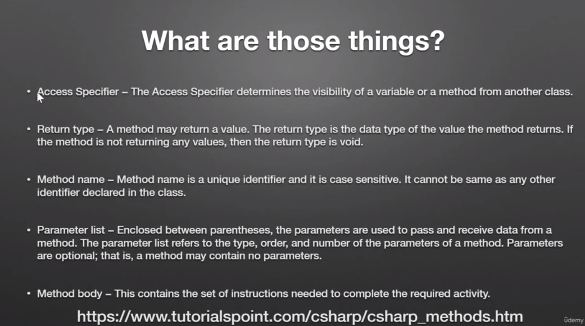

# Methods in C#

### What is a method?

    - A method is a code block that contains a series of statements. A program causes the statements to be executed by calling the method and specifying any required method arguments. In C#, every executed instruction is performed in the context of a method. The main method is the entry point for every C# application and it is called by the common language runtime (CLR) when the program is started.

```csharp
<Access Specifier><Return Type><Method Name>(Parameter List)
{
    Method Body
}
```



### Example

```csharp
public int Add(int num1, int num2)
{
    int result = num1 + num2;
    return result;
}
```

## Method Challenge

## My Answer

```csharp

namespace ChallengeMethods
{
    class Program
    {
        static void Main(string[] args)
        {
            string stormy = "Stormy";
            string william = "William";
            string joe = "Joe";
            GreetFriend(joe);
            GreetFriend(william);
            GreetFriend(stormy);
        }

        public static string GreetFriend(string friendName)
        {
            Console.WriteLine($"Hi {friendName}, my friend!");
            return $"Hi {friendName}, my friend!";
        }
    }
}
```

## His Answer

```csharp

```

#
